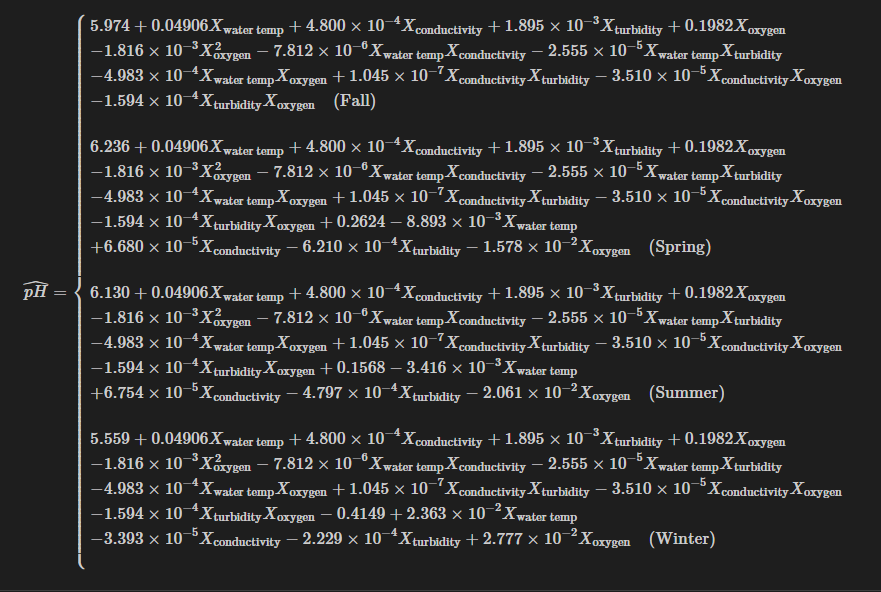

# Analysis of Water Quality in Calgary

This is a comprehensive statistical modelling attempt of Calgary's water pH via physico-chemical properties of water. Specifically for watershed surface bodies of water around Calgary (rivers, streams, reservoirs, etc..).

## About the Data 

The data is sourced from <a href="https://data.calgary.ca/Environment/Watershed-Surface-Water-Quality-Data/y8as-bmzj/about_data">Open Source Data of Calgary</a>. 

## Collaborators and Contributors

This was a course group project. Teammates are listed in the PDF report. 

**Main Contributions**
1. Assisted in modelling
2. Evaluation of the model through multi-linear regression modelling assumptions and statistical tests
3. Scientific Review  

## Analysis 

We were able to produce the following model: 

The model has an adjusted R-squared 0.5369 with 0.2032 residual standard error. The model explains 53.69% of the variation found in the dependent variable, pH.
